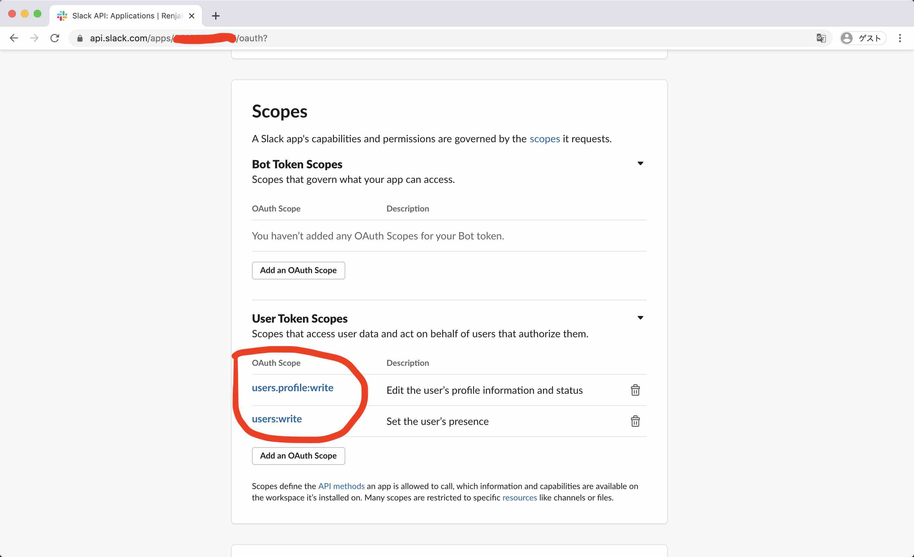

# Slack Status Updater

自分の位置領域を常に把握し、Slack ユーザーステータスに反映するアプリです。


## 構成


## Slack API トークン取得

非推奨の[レガシートークン](https://api.slack.com/legacy/custom-integrations/legacy-tokens)を使う手もありますが、ちゃんと OAuth トークンの取得方法を載せておきます。

↓アプリを作成します。


↓ワークスペースに対するアクセス権限を定義します。
自分のユーザー情報を変更できる権限のみをユーザートークンに設定します。
これでトークンが悪意のある第三者に知られても、あなたの情報を変更することしかできません。




↓インストールします。


↓権限を許可すると、トークンが生成されます。


## Google Apps Script 作成

↓Spreadsheet に紐付くスクリプトを作成します。
Spreadsheet は、IFTTT Webhook で受信したデータのストレージとして機能します。


↓スクリプトエディタを開きます。


↓[スクリプト](google-apps-script.gs.js)をコピペし、Slack トークンをはじめとした必要な情報を埋めます。


↓IFTTT の Webhook となる Web App をデプロイします。


↓Execute the app as: Me (自分が実行), Who has access to the app: Anyone, even anonymous (誰でもアクセス可) となっていることに注意してください。


↓Web App の次は、トリガーを追加します。


↓実行する関数は update です。また Spreadsheet の内容をポーリングすることになるので、実行頻度は短めにします。


↓ちなみにスクリプトの実行ログはここで見れます。


## Google Calendar 予定を追加

在宅勤務を想定する以上、特定の場所にいるだけでステータスを決定するわけにはいきません。寝ている間もずっと働いてることになってしまいます。カレンダーの予定も考慮することにしましょう。

↓このような形で、その日はどこで働くのかわかるように、場所をタイトルに含めた予定をまとめてドカンと追加しましょう。画像では、休暇を入れながら、原則として月曜だけ出社することにしています。


## IFTTT レシピ作成

在宅勤務、職場勤務、この 2 つの場所のレシピを作成します。今回は 2 つだけですが、場所の数だけレシピは必要です。

↓まずは、在宅勤務レシピの This を作成していきます。


↓This は、Location サービスを設定します。


↓入出の情報が欲しいので、トリガーは左下の "You enter or exit an area" にします。


↓あなたの家の場所を範囲指定します。範囲が広すぎても狭すぎてもよくないので、ちょうどいい感じに調整します。


↓今度は That です。


↓That は Webhooks にします。入出のタイミングで Web App を実行してもらうためです。


Location で設定した位置範囲に来た時、Google Apps Script の Web App に、`entered` または `exited` という文字列が POST されます。
それぞれ、範囲への入と出を表します。
URL は Web App をデプロイした際に取得できる URL の末尾に `?place={場所名}`
を追加しておきます。場所名は、レシピによって異なるので以下を参考に設定してください。

- 在宅勤務レシピ URL に追加する文字列: `?place=%E5%9C%A8%E5%AE%85`
- 職場勤務レシピ URL に追加する文字列: `?place=%E8%81%B7%E5%A0%B4`

JavaScript の実行環境があれば、以下の要領で場所名を作成できます。

```javascript
encodeURIComponent('在宅') == '%E5%9C%A8%E5%AE%85'
encodeURIComponent('職場') == '%E8%81%B7%E5%A0%B4'
```

↓


↓レシピの名前を設定して完了です。


↓Connected になっていることを確認します。


同じ要領で「職場勤務」レシピも作成したら完成です！
